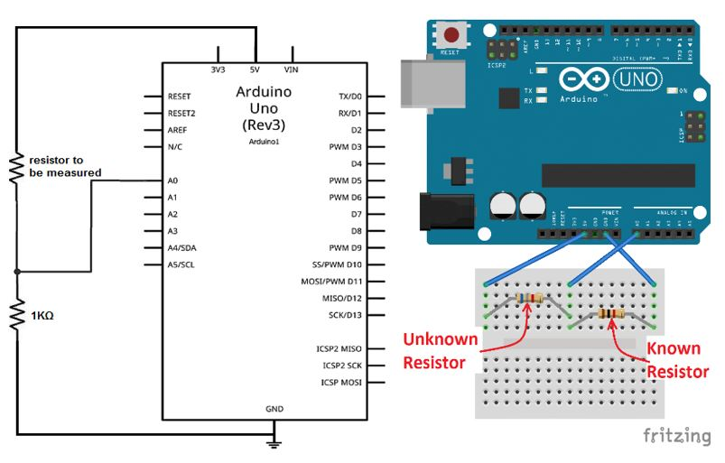

# Topic: Resistance measurement
## Description: 
Use the analog inputs and digital outputs (and probably a voltage divider) to determine the value of resistors. The measurement must be continuously, and the result must be shown on a display (TFT or Nokia or LED-display). Check for extreme values and warn the user via display or beeper. Signal if measurement is ongoing or has ended and values are valid.

## Requirements:
1.	Arduino Uno Board
2.	Breadboard
3.	TFT or Nokia or LED-display
4.	One known resistance (maybe 1kΩ)
5.	One unknown resistance which will be measured
6.	Jumper wires x 20 (number may vary in real time)

## Underlying Principle: 
Two resistances (one known 1000 Ω and another unknown, say R Ω, that has to be measured) has been placed in series across 5 volt and GND (0 volt) of the Arduino board.
Voltage drop between two resistances, say Vd volt, measured by Arduino pin A0.
The current passing through the 1kΩ and the unknown resistance would be same, since they are in series.
Formula: (5 – Vd) / R = (Vd – 0) / 1000, 
	R = 1000 ( 5/Vd – 1) Ω
  
## Schematic:

## Summary:
We are able to measure any resistance between 500 Ω to 2700 Ω successfully using Arduino.
The value of the unknown resistance is shown in the given display in Ω.
If the unknown resistance is less than 500 Ω or greater than 2700 Ω, then, we warn the user via display, that, resistance value is out of range.
